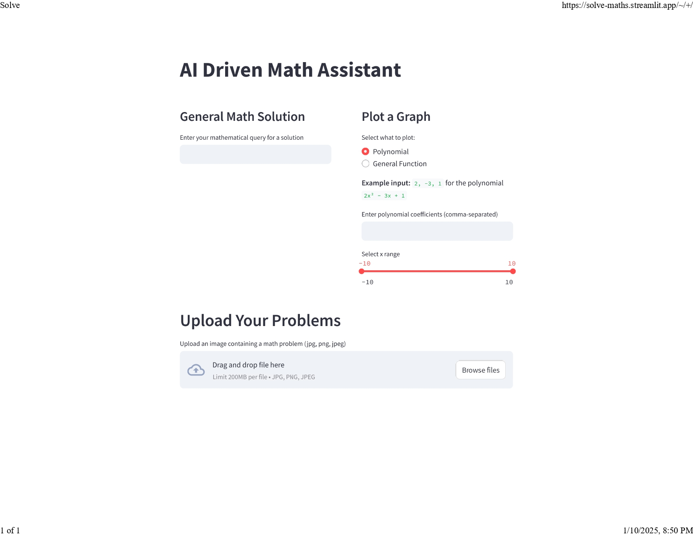

# AI Driven Math Chatbot
### Home Screen


## Overview
The **AI-Driven Mathematics Chatbot** is an advanced tool designed to solve complex mathematical problems, plot graphs, and extract math problems from images using OCR. It leverages OpenAI's GPT-4 API and supports both numerical and word-based math queries.

---

## Features

- **Math Problem Solving**: Handles basic to advanced engineering math problems.
- **Graph Plotting**: Plots graphs of functions, equations, polynomials, and geometric shapes.
- **OCR Integration**: Detects and solves math problems directly from uploaded simple images queries.
- **User-Friendly Interface**: Built using Streamlit for seamless deployment and interaction.

---

## Technologies Used

- **Programming Language**: Python
- **Libraries**:
  - OpenAI
  - Matplotlib
  - SymPy
  - PyTesseract
  - Streamlit
- **API**: OpenAI GPT-4

---

## Installation

1. Clone the repository:
   ```bash
   git clone https://github.com/your-username/ai-math-chatbot.git
   cd ai-math-chatbot
   ```

2. Install dependencies:
   ```bash
   pip install -r requirements.txt
   ```

3. Run the chatbot locally:
   ```bash
   streamlit run app.py
   ```

---

## How to Use

1. **Math Queries**: Type your mathematical question in the text input box.
2. **Graph Plotting**: Ask to plot functions like `sin(x)`, `x^2`, or custom equations.
3. **OCR Functionality**: Upload an image containing a math problem and let the chatbot extract and solve it but its in nacent stage and cannot handel complex problems.

---
## Presentation

Download the project presentation:
[AI Driven Math Chatbot Presentation](Presentation.pptx)

## Demo Video
[AI Driven Math Demo Video Presentation/Downlaod](DemoVideo.mp4)

## Deployment

The project can be deployed on Streamlit Cloud:

1. Link your GitHub repository.
2. Configure your `requirements.txt` and `secrets.toml` for API key management.
3. Deploy and share your app using the Streamlit Cloud URL.

---

## Contributing

Contributions are welcome! Please fork the repository and submit a pull request with your improvements.

---

## License

This project is licensed under the [MIT License](LICENSE).

---

## Contact

For questions or feedback, contact:
- **Email**: your-mohanbudha000@gmail.com
- **GitHub**: [your-username](https://github.com/Budha-Mohan)
